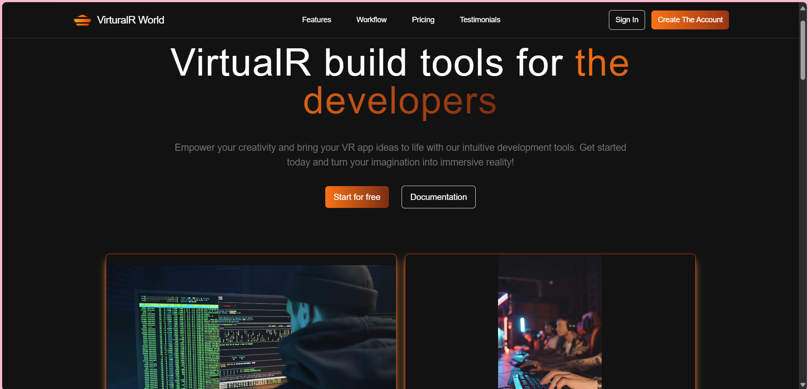

# Virtual World Website

A Virtual World project built with **React** and **Vite**.

## 🖼️ Preview



> (Make sure to upload your preview image as `preview.png` in the project root.)

## How to Run

1. Clone the repository or download the `.zip` file and extract it.
2. Install dependencies:
   ```bash
   npm install
   ```
3. Start the development server:
   ```bash
   npm run dev
   ```

Project will be available at:  
[http://localhost:5173](http://localhost:5173)

## Build

```bash
npm run build
```

Production files will be generated in the `dist/` folder.

## Tech Stack

- React
- Vite
- JavaScript
- CSS
